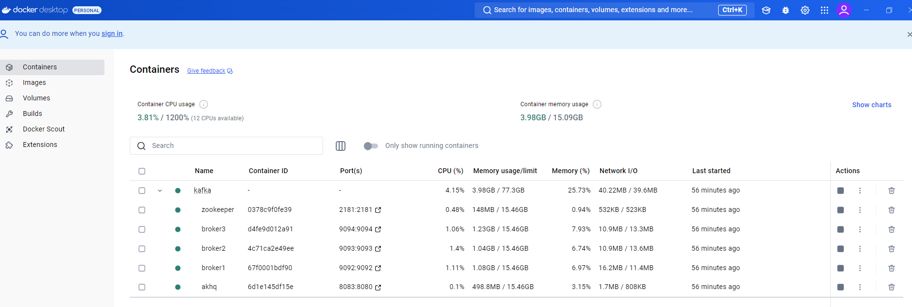
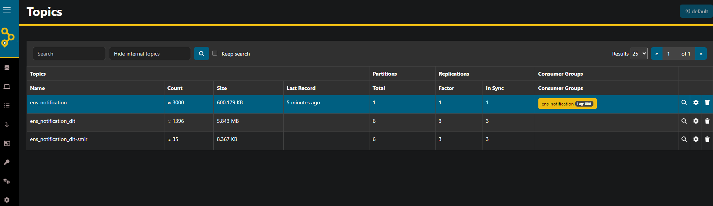
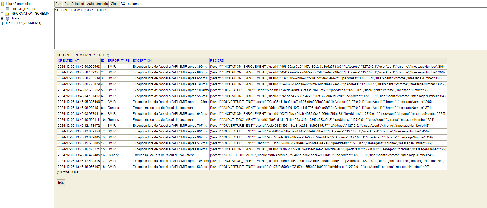

# Kafka Streams Notification Demo  

Ce dépôt regroupe les différents projets nécessaires pour mettre en place un système de messagerie Kafka multi-brokers, avec un producteur et un consommateur.  

## Contenu du dépôt  

1. **notification-broker** :  
   - Fournit une infrastructure Kafka avec 3 brokers via un fichier Docker Compose.  
   - Inclut un script de démarrage `run-kafka.sh` pour initialiser les brokers et créer les topics nécessaires avec 3 replications.  

2. **notification-producer-demo** :  
   - Un producteur Kafka qui envoie 1000 messages au topic `ens_notification` à chaque exécution.  

3. **notification-consumer-demo** :  
   - Un consommateur Kafka qui lit les messages du topic `ens_notification` avec Kafka Streams.  
   - Ce consommateur applique les règles suivantes
		- Filtrage des Notifications
          - Les notifications immédiates (event.getFrequency() est null ou différent de FrequenceEvenement.DIFFEREE) seront traitées immédiatement.
          - Les notifications différées (event.getFrequency() est FrequenceEvenement.DIFFEREE) sont regroupées par clé (ensId | typeNotification) et agrégées dans une fenêtre temporelle.
        - Les notifications sont envoyées dans un topic `ens_notification_queue`
		- Redirection des erreurs dans une DLT `ens_notification_dlt`

---

## Prérequis  

- [Docker](https://www.docker.com/) et [Docker Compose](https://docs.docker.com/compose/) installés.  
- Java 23 (peut etre recompilé en Java 17+) pour le producteur et le consommateur.  

---

## Configuration et Exécution  

### Étape 1 : Lancer l'infrastructure Kafka  

1. Positionnez-vous dans le dossier `notification-broker`.  
2. Exécutez le script de démarrage :  
   ```bash
   ./run-kafka.sh
   ```
  
Kafka et ses brokers seront démarrés, et les topics nécessaires (ens_notification, ens_notification_dlt, et ens_notification_dlt-smir) seront créés automatiquement



### Étape 2 : Lancer la console AKHQ

Une interface web AKHQ est disponible pour gérer et visualiser les topics Kafka.
Accédez-y via http://localhost:8083.

Structure des Topics Kafka
ens_notification : Topic principal pour les notifications.
ens_notification_dlt : Topic pour les messages échoués.


   
### Étape 3 : Lancer la console H2

Une interface web H2 Console est disponible pour gérer et visualiser la base de données.
Accédez-y via http://localhost:8080/h2-console/



### Étape 4 : Lancer le consommateur Kafka

Adapter la configuration souhaitée dans

notification-consumer-demo\src\main\resources\applioation.yml

Pour plus de détails voir https://github.com/flake9025/kafka-notification-demo/blob/main/notification-consumer-demo/README.md


   ```bash
   java -jar notification-consumer-demo/target/notification-consumer-demo.jar
   ```

### Étape 5 : Lancer le producteur Kafka

   ```bash
   java -jar notification-producer-demo/target/notification-producer-demo.jar
   ```
  